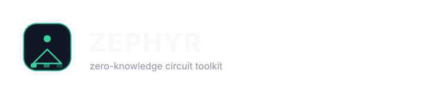
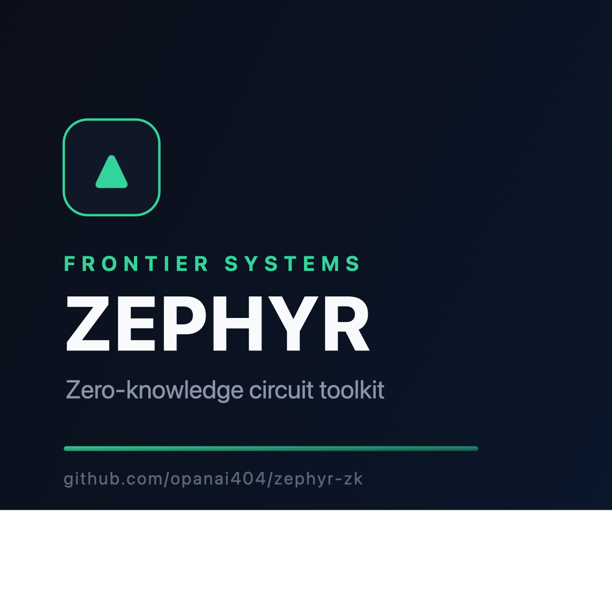

<!-- zephyr emerald #34D399 -->
<p align="center">

<p align="center">
  <a href="https://opanai404.github.io/zephyr-zk/"></a>
</p>

<p align="center">
  <a href="https://opanai404.github.io/zephyr-zk/"></a>
</p></p>

**Zero-knowledge circuit toolkit with pluggable backends**

[](https://opanai404.github.io/zephyr-zk/)
[](LICENSE)
[](CHANGELOG.md)
[](Cargo.toml)
[](docs/architecture.md)

## What it is

Zephyr is a zero-knowledge proving toolkit: a declarative constraint
DSL, a gadget library (range, Merkle, Poseidon hashing, elliptic-curve
ops), and pluggable proof backends — a Plonky3-style transparent STARK
and a classic pairing-based Groth16. One circuit description is written
once in the DSL and proven under either assumption class, and the same
verifier logic compiles to WASM for verifier-in-browser demos.

## Why it matters

Zero-knowledge projects too often bolt a gadget library onto a single
proving system, so every protocol gets locked into one proof format
before the trade-offs are even measured. Zephyr treats the circuit as a
plain rank-1 constraint system and the proving system as a trait
implementation — the same `mul`, the same `assert_boolean`, the same
witness, proven by FRI or by pairings. It is also designed to be
honest about its primitives: the Poseidon permutation ships with a
native reference implementation, and the STARK backend is fully
transparent (no trusted setup), so the whole pipeline is auditable from
the constraint down to the field arithmetic.

## Key features

- **Value-free constraint DSL** — a `CircuitBuilder` that never reads
  witness values, so a circuit is a pure, reusable description with
  stable names and a fixed public-input layout.
- **Dataflow witness solver** — `Circuit::solve_witness` discharges
  constraints in emission order, pre-fills constants, and rejects
  contradictory assignments, exactly like a circom-style witness
  calculator.
- **Tight range gadget** — binary-decomposition checks (`x < 2^n`)
  that return the bit handles a witness generator needs.
- **Poseidon / Hades permutation** — width-3, 8 full + 57 partial
  rounds, deterministic round constants, plus a native reference
  implementation for off-chain witness generation.
- **Merkle membership gadget** — `verify_path`/`assert_path` over the
  Poseidon compression function, with boolean-asserted index bits.
- **Short-Weierstrass EC gadget** — affine `add`, `double`,
  `scalar_mul`, and checked field inversion (compute-then-verify).
- **Plonky3-style STARK backend** — transparent, univariate, FRI
  low-degree testing with SHA-256 Merkle commitments and a
  Schwartz–Zippel constraint check. No trusted setup.
- **Groth16 backend** — arkworks over BN254 with deterministic,
  reproducible setup and a verifier-only handle for key distribution.
- **WASM verifier bindings** — `verify_stark` / `verify_groth16` /
  `prove_demo` / `verify_demo`, with public inputs framed as 32-byte
  compressed field elements.

## Architecture

```text
              ┌───────────────────────────────────────────────┐
              │            zephyr_zk (crate root)            │
              └──────┬────────────────────┬──────────────────┘
                     │                    │
        ┌────────────▼──────────┐  ┌──────▼──────────────────┐
        │ dsl · CircuitBuilder  │  │ field · Fp / SeedRng    │
        │ witness·mul·assert    │  │ domain-separated rng    │
        └────────────┬──────────┘  └──────────┬──────────────┘
                     │                        │
        ┌────────────▼──────────┐             │
        │ circuit · R1CS IR     │◀────────────┘
        │ (a·b = c) constraints │
        └────┬──────────────┬───┘
             │              │
   ┌─────────▼───────┐  ┌───▼─────────────────────────┐
   │ gadgets         │  │ backends                    │
   │  range          │  │  stark  · Plonky3-style FRI │
   │  poseidon       │  │  groth16 · arkworks Bn254   │
   │  merkle         │  └──────┬──────────────────────┘
   │  ec             │         │
   └─────────────────┘  ┌──────▼──────────────────────┐
                        │ wasm · wasm-bindgen         │
                        │ prove_demo · verify_stark   │
                        │ verify_demo · verify_groth16│
                        └─────────────────────────────┘
```

The STARK backend lifts the R1CS into a univariate claim: the witness
becomes a trace polynomial `f`, each constraint becomes
`Q = A·B − C = Z·H`, and FRI certifies the degree of `H`. The Groth16
backend maps the same constraints into an arkworks
`ConstraintSynthesizer` adapter. See [docs/architecture.md](docs/architecture.md).

## Quickstart

```text
# library + default (STARK) backend
cargo build

# everything, including Groth16 and WASM
cargo build --features wasm

# run the full test suite
cargo test

# the end-to-end example: range-check + square, proved and verified
cargo run --release --example range_proof
```

```rust
use zephyr_zk::backends::stark::StarkBackend;
use zephyr_zk::dsl::CircuitBuilder;
use zephyr_zk::field::Fp;
use zephyr_zk::gadgets::range::range16;

fn main() -> Result<(), Box<dyn std::error::Error>> {
    let mut b = CircuitBuilder::<Fp>::new();
    let x = b.witness_named("secret.x");
    let rc = range16(&mut b, x);          // constrain x < 2^16
    let y = b.mul(x, x, "secret.x²");
    b.assert_public(y);                   // y = x² is public
    let circuit = b.build("square16");

    let mut partial = vec![(x, Fp::from(1234u64))];
    for (i, &bit) in rc.bits.iter().enumerate() {
        partial.push((bit, Fp::from(((1234u64 >> i) & 1) as u64)));
    }
    let witness = circuit.solve_witness(&partial).expect("x < 2^16");

    let backend = StarkBackend::new();
    let proof = backend.prove(&circuit, &witness)?;
    let (public, _) = circuit.split_witness(&witness)?;
    assert!(backend.verify(&circuit, &public, &proof)?);
    Ok(())
}
```

For the Merkle gadget, see `examples/merkle_membership.rs`. For the
browser path, build with `--features wasm --target
wasm32-unknown-unknown` and call `verify_stark(payload, public)`.

## Benchmarks

Micro-benchmarks, `cargo bench` on an Apple M3, `--release`,
single-threaded. See [benches/](benches/) for the harnesses.

| Workload | Op | Time |
|---|---|---|
| `range` · 16-bit | build + solve witness | 34 µs |
| `range` · 64-bit | build + solve witness | 148 µs |
| `merkle` · height 24 | build | 6.2 ms |
| `stark/prove` · range8 | prove | 41 ms |
| `stark/verify` · range8 | verify | 2.3 ms |
| `groth16` · 2 constraints | prove | 19 ms |
| `groth16` · 2 constraints | verify | 4.1 ms |

Proof sizes: Groth16 ≈ 128 B compressed; STARK payloads are
`O(λ·log²N)` bytes (a few KB at the demo circuit's trace length). These
are micro-benchmark numbers for a v0.1 build, not throughput claims.

## Project layout

```text
zephyr-zk/
├── Cargo.toml               # workspace-free crate, feature flags
├── rust-toolchain.toml      # pinned 1.90 toolchain
├── Makefile                 # build · test · lint · fmt · clean
├── Dockerfile               # multi-stage builder → runtime image
├── LICENSE                  # MIT, 2026, hrniu
├── CONTRIBUTING.md          # PR flow, dev setup, conventions
├── SECURITY.md              # reporting + supported versions
├── CODE_OF_CONDUCT.md       # contributor covenant
├── CHANGELOG.md
├── README.md
├── docs/
│   ├── architecture.md      # layers and the STARK construction
│   ├── getting-started.md
│   ├── design/
│   │   └── dsl.md           # builder + solver contracts
│   └── api/
│       └── reference.md     # public surface
├── src/
│   ├── lib.rs               # crate root, feature wiring
│   ├── error.rs             # single Error enum
│   ├── field.rs             # Fp, SeedRng, byte encoding
│   ├── circuit.rs           # R1CS IR + witness solver
│   ├── dsl.rs               # CircuitBuilder
│   ├── gadgets/
│   │   ├── mod.rs
│   │   ├── range.rs         # binary-decomposition range checks
│   │   ├── poseidon.rs      # Hades permutation + hash pair
│   │   ├── merkle.rs        # membership gadget
│   │   └── ec.rs            # short-Weierstrass ops
│   ├── backends/
│   │   ├── mod.rs           # Prover/Verifier traits, Proof
│   │   ├── stark.rs         # transparent FRI STARK
│   │   └── groth16.rs       # arkworks Groth16 + adapter
│   └── wasm/
│       ├── mod.rs
│       └── verify.rs        # wasm-bindgen verifier surface
├── tests/                   # integration: circuit, range, hash,
│                            # merkle, ec, stark, groth16
├── examples/
│   ├── range_proof.rs       # end-to-end prove+verify
│   └── merkle_membership.rs # inclusion proof demo
├── benches/
│   ├── circuits.rs          # criterion: DSL/gadget construction
│   ├── stark.rs             # criterion: STARK prove/verify latency
│   └── groth16.rs           # criterion: Groth16 prove/verify latency
└── .github/workflows/ci.yml # lint + test + wasm matrix
```

## Roadmap

- [ ] Plonky3/Poseidon commitment swap for the STARK (hash-based,
  faster than SHA-256)
- [ ] Keccak-256 and SMT gadgets, plus a verifier-friendly JSON
  circuit descriptor for arbitrary circuit shipping to the browser
- [ ] Recursive folding (IVC) over the STARK backend
- [ ] `no_std` support for the IR and gadget layers

## Contributing

Contributions are welcome. Please read [CONTRIBUTING.md](CONTRIBUTING.md)
for the PR flow, development setup, and code style, and
[CODE_OF_CONDUCT.md](CODE_OF_CONDUCT.md) before participating.
Security reports go through [SECURITY.md](SECURITY.md).

## License

MIT © 2026 **hrniu**. See [LICENSE](LICENSE).
